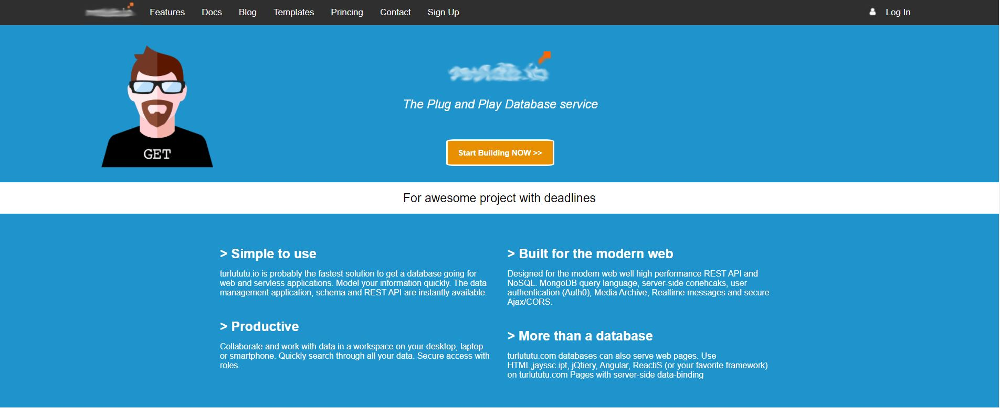
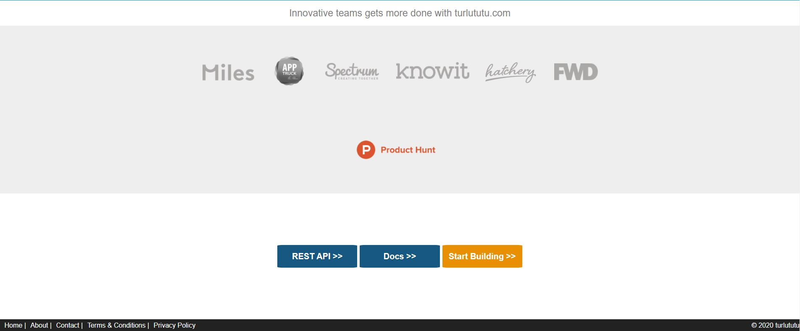

# **WELCOME TO TURLUTUTU**

**What was the project ?**

*-I had to start from an image of a web page and reproduce the same layout but using HTML and CSS.*

**How did i do it ?**

*-I used **section** and **div** for each section of my HTML file, which I implemented and modified in my CSS with "flex-box".*

**What does it look like ?**

*-Here is the direct link to the site I made [Homepage of Turlututu]()*

**Here is some screenshots of the website :**

**© El Yazizi Ayoube**
